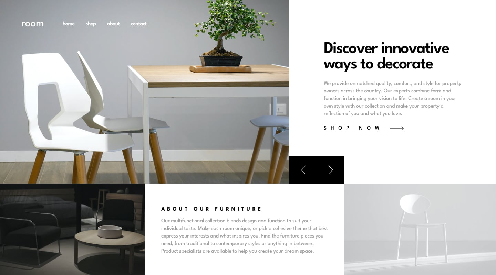
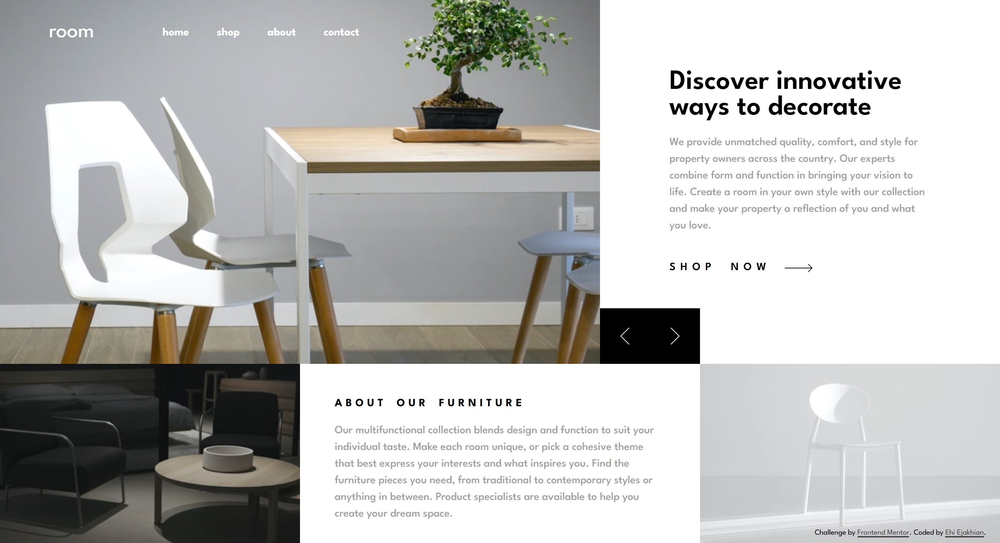

# Frontend Mentor - Room homepage solution

Hi! I'm Ehi. This is my solution to the [Room homepage challenge on Frontend Mentor](https://www.frontendmentor.io/challenges/room-homepage-BtdBY_ENq). Frontend Mentor challenges help you improve your coding skills by building realistic projects. 

## Table of contents

- [Meet me](#hi)
- [Overview](#overview)
  - [The challenge](#the-challenge)
  - [Screenshot](#screenshot)
  - [Links](#links)
- [My process](#my-process)
  - [Built with](#built-with)
  - [What I learned](#what-i-learned)
  - [Continued development](#continued-development)
- [Author](#author)
- [Acknowledgments](#acknowledgments)

# Hi!
I'm Ehi. I'm a front-end web developer and sketch artist! I live in Edostate, Nigeria. I love code.

## Overview

### The challenge

Users should be able to:

- View the optimal layout for the site depending on their device's screen size
- See hover states for all interactive elements on the page
- Navigate the slider using either their mouse/trackpad or keyboard

### Screenshot


**My Competition**


**My Design**

I did it. Its decent and I'm happy with it.

### Links

- Solution URL: [https://github.com/Ehiejakhian/Frontend-Mentor-Room-homepage](https://github.com/Ehiejakhian/Frontend-Mentor-Room-homepage)
- Live Site URL: [**https://ehiejakhian.github.io/Frontend-Mentor-Room-homepage/**](https://ehiejakhian.github.io/Frontend-Mentor-Room-homepage/)

## My process
I usually start by writing my creating my project structure. I have a template model I work on to create my files. And this is especially makes specifying file paths accurate for my compiled CSS from SCSS easy to write and understand.
I then take some time to look at the project's design files, at least 3 minutes. I chheck the atates, the mobile and desktop proportions and then organize what I see into sections that I can style easily with SCSS. Then I create a git repo to house my changes to the project and publish it.  

### Built with
I built this page with:
- Semantic HTML5 markup
- CSS custom properties
- Flexbox
- CSS Grid
- Mobile-first workflow
- **SCSS/SASS**
- and JavaScript

### What I learned

CSS **anchor positioning** is probaply one of the best things that ever happened to me on tis project. Apply an anchor name to the parent, use the **`position-anchor`** and **`position-area`** rules on the child element and you're good to go. Just like this:

```scss
.parent {
  anchor-name: --whatever;
  &__child {
    position: absolute;
    position-anchor: --whatever;
    // position-area: bottom left;
    // or
    // left: anchor(left);
    // bottom: anchor(bottom);
  }
}
```

I also learnt something else - Event delegation in Javascript. See what I mean;

Instead of:
```js
let btn_left = document.querySelector('.left');
let btn_right = document.querySelector('.right');

const buttons = [btn_left, btn_right];
buttons.forEach((btn, i) => {
  btn.addEventListener('click', () => {
    console.log('clicked')
    let arr = Array.from(btn.classList)
    console.log(arr)
    if (arr.includes('left')) {
      (currentSlide <= 1) ? currentSlide = 1 : currentSlide--;
    }else if (arr.includes('right')) {
      (currentSlide >= 3) ? currentSlide = 3 : currentSlide++;
    }
    domTime(currentSlide);
  })
})
```
We use:
```js
let hero_section = document.querySelector('.hero');
hero_section.addEventListener('click', (e) => {
  if (e.target.closest('.left')) {
    console.log('left clicked');
    (currentSlide <= 1) ? currentSlide = 1 : currentSlide--;
    domTime(currentSlide);
  } else if (e.target.closest('.right')) {
    console.log('right clicked');
    (currentSlide >= 3) ? currentSlide = 3 : currentSlide++;
    domTime(currentSlide);
  }
});
```
This is great especially when replacing and restructuring elements in the dom that have event listeners attached to them.

### Continued development

Truth is, I know I could have made this solution a whole lot better than this, but I didn't. I could have preloaded images in Javascript for zero lag on a page refresh, I could have made all this with CSS only but I didn't. I have been a lazy coder for some months now, and I want to get serious little by little. Anyway, tell me what you think [**here**](https://wa.me/+2348142340182?text=Hello%20Ehi%20.%20I%20checked%20your%20website.%20).


## Author

- Website - [**ehiejakhian.github.io**](https://ehiejakhian.github.io/)
- Frontend Mentor - [@EhiEjakhian](https://www.frontendmentor.io/profile/EhiEjakhian)


## Acknowledgments

A big **thank you** to everyone out there who offers free online resources to learn code and oter stuff out there. Thanks for viewing my solution too. It truly means a lot to me that you’re looking at my Frontend Mentor solution. I don’t take that for granted at all. Thank you.
